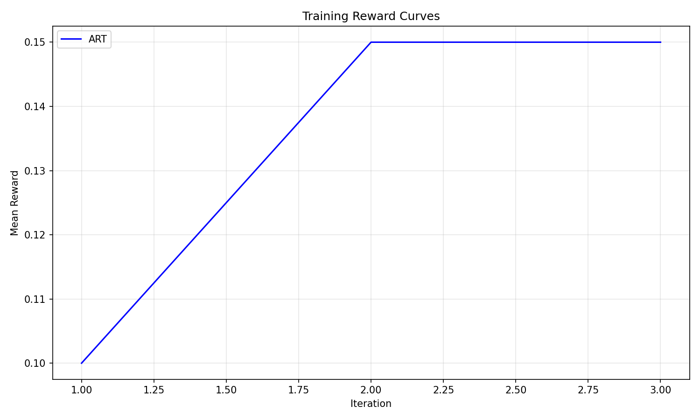
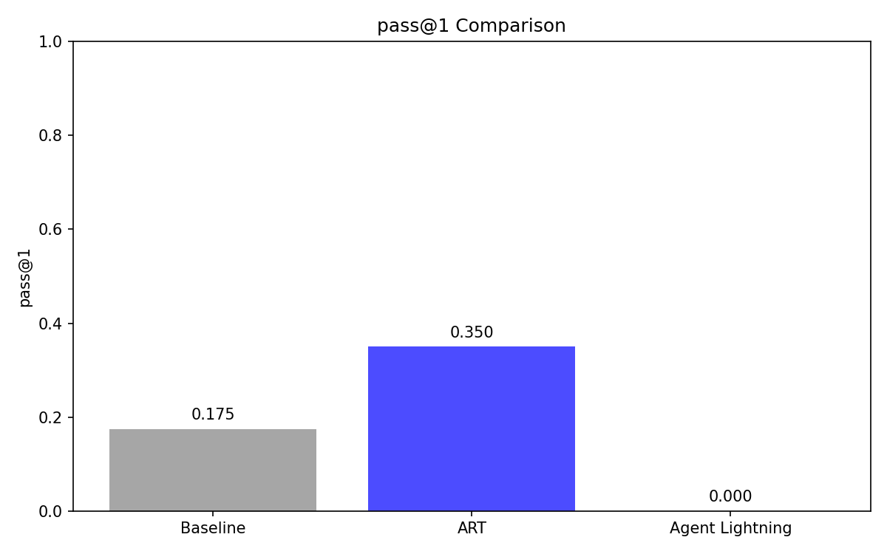
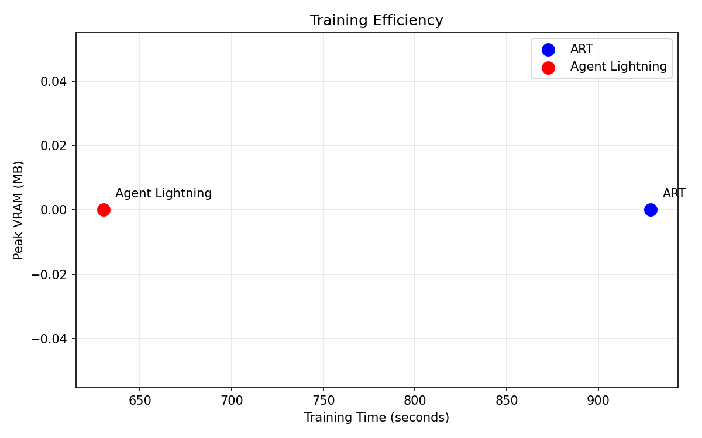

# Agentic RLVR PoC: ART vs Agent Lightning

## Summary

### Baseline (Pre-Training)

- **pass@1**: 0.175
- **pass@k**: 0.279
- **Mean reward**: 0.175

### Post-Training Comparison

| Metric | ART (OpenPipe) | Agent Lightning (Microsoft) |
|--------|---------------|----------------------------|
| pass@1 | 0.350 | N/A |
| pass@k | 0.392 | N/A |
| Mean reward | 0.350 | N/A |
| pass@1 improvement | 0.175 | N/A |
| Training time (s) | 928.556 | 630 |
| Peak VRAM (MB) | 0 | 0 |
| Rollouts/second | 0.065 | 0.000 |
| Avg turns | 11.125 | N/A |

### Training Details

#### ART (OpenPipe)

- **Iterations**: 3
- **Group size**: 4
- **Learning rate**: 1e-05
- **Total rollouts**: 60
- **Final mean reward**: 0.15

#### Agent Lightning (Microsoft)

- **Total epochs**: N/A
- **Batch size**: N/A
- **Learning rate**: 1e-06
- **N runners**: 4

### Plots

